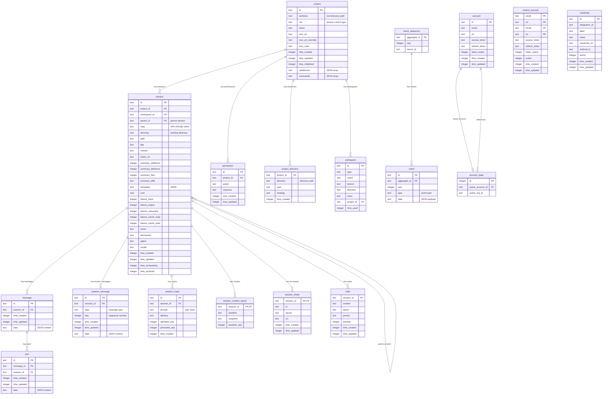

# OpenCode Database Schema

> SQLite database: `~/.local/share/opencode/opencode.db`

## Entity Relationship Diagram



---

## Table Reference

### Core

| Table | Purpose |
|-------|---------|
| `project` | Registered projects (repos). `worktree` = root path. |
| `project_directory` | Multiple directories per project (monorepo support). |
| `workspace` | Workspaces within a project (branch-based isolation). |

### Sessions

| Table | Purpose |
|-------|---------|
| `session` | Chat sessions. Links to project, tracks costs/tokens. |
| `session_input` | User prompts with delivery status and sequencing. |
| `session_message` | Low-level session events (tool calls, system events). |
| `session_context_epoch` | Context snapshots for compaction/recovery. |
| `session_share` | Public sharing links for sessions. |
| `todo` | Task list items within a session. |

### Messages

| Table | Purpose |
|-------|---------|
| `message` | Conversation messages (user + assistant turns). |
| `part` | Message parts (text, tool calls, tool results). |

### Event Sourcing

| Table | Purpose |
|-------|---------|
| `event_sequence` | Aggregate sequence counters. |
| `event` | Immutable event log per aggregate. |

### Auth

| Table | Purpose |
|-------|---------|
| `account` | User accounts with OAuth tokens. |
| `account_state` | Currently active account/org. |
| `control_account` | Control plane accounts (composite PK: email+url). |
| `credential` | API keys and integration credentials. |

### Other

| Table | Purpose |
|-------|---------|
| `permission` | Per-project action/resource permissions. |
| `data_migration` | Migration tracking. |
| `migration` | Schema migration tracking. |

---

## Key Relationships

```
project (1) ──── (N) session ──── (N) message ──── (N) part
    │                  │
    │                  ├── (N) session_input
    │                  ├── (N) session_message
    │                  ├── (1) session_context_epoch
    │                  ├── (0..1) session_share
    │                  └── (N) todo
    │
    ├── (N) permission
    ├── (N) project_directory
    └── (N) workspace
```

## Indexes

| Table | Index | Columns |
|-------|-------|---------|
| `event` | `event_aggregate_seq_idx` | `(aggregate_id, seq)` UNIQUE |
| `event` | `event_aggregate_type_seq_idx` | `(aggregate_id, type, seq)` |
| `permission` | `permission_project_action_resource_idx` | `(project_id, action, resource)` UNIQUE |
| `message` | `message_session_time_created_id_idx` | `(session_id, time_created, id)` |
| `part` | `part_message_id_id_idx` | `(message_id, id)` |
| `part` | `part_session_idx` | `(session_id)` |
| `session` | `session_project_idx` | `(project_id)` |
| `session` | `session_workspace_idx` | `(workspace_id)` |
| `session` | `session_parent_idx` | `(parent_id)` |
| `session_input` | `session_input_session_pending_delivery_seq_idx` | `(session_id, promoted_seq, delivery, admitted_seq)` |
| `session_input` | `session_input_session_admitted_seq_idx` | `(session_id, admitted_seq)` UNIQUE |
| `session_input` | `session_input_session_promoted_seq_idx` | `(session_id, promoted_seq)` UNIQUE |
| `session_message` | `session_message_session_seq_idx` | `(session_id, seq)` UNIQUE |
| `session_message` | `session_message_session_type_seq_idx` | `(session_id, type, seq)` |
| `session_message` | `session_message_session_time_created_id_idx` | `(session_id, time_created, id)` |
| `session_message` | `session_message_time_created_idx` | `(time_created)` |
| `todo` | `todo_session_idx` | `(session_id)` |
